# Authentication & Biometric Flows

> **Where this fits in the docs**: This document is scenario-first. It answers "what actually happens when X?" with full data-flow diagrams, every error branch, and state snapshots at each stage.
> For the code-level reference (file structure, API contracts, storage helpers), see [AUTHENTICATION.md](./AUTHENTICATION.md).

---

## How to Read This Document

- **Diagrams** are Mermaid. Sequence diagrams show time-ordered steps. Flowcharts show decision branches.
- **State snapshots** are tables that appear after key transitions. They show exactly what is stored in each layer at that exact moment — this is the fastest way to understand what's going on if something breaks.
- **Every failure branch in the actual code is included.** Nothing is simplified away.

---

## The Three State Layers

Every auth operation touches up to three layers. Understanding the relationship between them is the foundation for everything in this document.

| Layer | What it is | Location | Speed | Encrypted? | Survives app kill? |
|---|---|---|---|---|---|
| **SecureStore** | Persistent encrypted storage | iOS Keychain / Android KeyStore | Async | Yes | Yes |
| **MMKV** | Fast synchronous cache | On-device file | Sync | No | Yes |
| **Redux** | In-memory single source of truth | JS heap | Sync | No | **No** |

**The rule**: Redux is the source of truth *while the app is running*. Navigation, API calls, and UI all read from Redux. SecureStore and MMKV are the source of truth *across app restarts* — on every startup, they hydrate Redux. On every auth operation, all three layers are kept in sync.

### What lives where

| Data | SecureStore | MMKV | Redux |
|---|---|---|---|
| Access token | `auth_access_token` | — | `accessToken` |
| User profile | — | `user` | `user` |
| Tenant | — | `tenant` | `tenant` |
| Permissions | — | `permissions` | `permissions` |
| Biometric enabled | `biometric_enabled` | — | `biometricEnabled` |
| Login flag (gate) | — | `is_logged_in` | — |
| User email | `user_email` | — | — |

The `is_logged_in` flag in MMKV is the single gate that controls whether session restore even attempts to run. It is separate from `isAuthenticated` in Redux — Redux doesn't survive a kill, `is_logged_in` does.

---

## State Snapshot: Brand New Install

Before any code runs, this is the state of the world.

| SecureStore | MMKV | Redux (initialState) |
|---|---|---|
| `auth_access_token`: ∅ | `user`: ∅ | `user`: null |
| `biometric_enabled`: ∅ | `tenant`: ∅ | `tenant`: null |
| `user_email`: ∅ | `permissions`: ∅ | `permissions`: [] |
| | `is_logged_in`: ∅ (reads as `false`) | `accessToken`: null |
| | | `isAuthenticated`: false |
| | | `biometricEnabled`: false |
| | | `isLoading`: false |

---

## Scenario Map

Use this to find the right section. It mirrors the actual decision tree in the code.

```mermaid
flowchart TD
    Start([App Launches]) --> CheckLoggedIn{"MMKV: is_logged_in?"}

    CheckLoggedIn -->|false| CheckBiometric{"SecureStore: biometric_enabled = true\nAND token still exists?"}
    CheckLoggedIn -->|true| ReadAll["Read token from SecureStore\n+ user/tenant/permissions from MMKV"]

    CheckBiometric -->|"Yes (both true)"| S2["📌 Section 2: Cold Start —\nBiometric Session Preserved"]
    CheckBiometric -->|"No"| S1["📌 Section 1: Cold Start —\nNo Session"]

    ReadAll --> Validate{"user AND tenant\nexist in MMKV?"}

    Validate -->|Yes| S3["📌 Section 3: Warm Start —\nSession Restored"]
    Validate -->|No| Corrupted["⚠️ Corrupted data path:\nClear everything → SignIn\n(see Section 3, integrity check)"]

    S1 --> Login["User enters credentials →\n📌 Section 4: First Login"]
    Login --> BiometricPrompt["After login succeeds →\n📌 Section 5: Biometric Activation"]

    S2 --> BiometricLogin["User taps biometric button →\n📌 Section 6: Biometric Login"]

    S3 --> ActiveSession["Session active. If token\nexpires mid-use →\n📌 Section 7: Auto Token Refresh"]

    S3 --> LogoutFromSession["User taps logout →\n📌 Section 8: Logout Flows"]
    S2 --> LogoutFromSession
```

---

## 1. Cold Start — No Session

**When this runs**: First ever launch. Or the app was fully logged out and all data was cleared.

Nothing is in storage. `is_logged_in` is `false` (or absent, which reads as `false`). The session restore query short-circuits immediately — it never touches SecureStore.

**State after**:

| SecureStore | MMKV | Redux |
|---|---|---|
| *(all empty)* | `is_logged_in`: false | `isAuthenticated`: false |
| | *(all empty)* | `isLoading`: false |

**Why `is_logged_in` and not just "check if token exists"?** Reading the token requires an async SecureStore call. `is_logged_in` is a synchronous MMKV boolean. Checking it first lets the "no session" path resolve in under a millisecond with zero async work — the SignIn screen appears instantly.

---

## 2. Cold Start — Biometric Session Preserved

**When this runs**: The user previously logged in, enabled biometrics, and then logged out. The biometric-aware logout path deliberately leaves data in storage (see Section 8b for why). On the next cold start, `is_logged_in` is `false`, so session restore fails — but the biometric button becomes available because the token and user data are still there.

### 2a. App Startup → SignIn with Biometric Button

**State at this point** — note the asymmetry between layers:

| SecureStore | MMKV | Redux |
|---|---|---|
| `auth_access_token`: "token-xyz" ✓ | `user`: { id, name, email } ✓ | `user`: null |
| `biometric_enabled`: true ✓ | `tenant`: { id, name } ✓ | `tenant`: null |
| `user_email`: "..." ✓ | `permissions`: [...] ✓ | `permissions`: [] |
| | `is_logged_in`: **false** | `accessToken`: null |
| | | `isAuthenticated`: false |
| | | `biometricEnabled`: **true** ← set by useBiometrics |

SecureStore and MMKV hold the full previous session. Redux is empty except for `biometricEnabled`, which was just synced from SecureStore by the hook. The biometric button is visible. The user taps it — continue to **Section 6**.

### 2b. What if biometrics are NOT supported or NOT enrolled?

If `checkBiometricSupport()` returns `isAvailable: false` or `isEnrolled: false`, then `isBiometricLoginAvailable` is false regardless of the stored token. The biometric button does not render. The user must log in with email and password (Section 4), which will overwrite the stale session data.

---

## 3. Warm Start — Session Exists

**When this runs**: The app was running (or recently killed by the OS), the user was logged in, and `is_logged_in` is `true`. This is the fastest path to an authenticated session — no login needed.

```mermaid
sequenceDiagram
    participant App as App.tsx
    participant RootNav as RootNavigator
    participant Query as useRestoreSessionQuery
    participant MMKV
    participant SecureStore
    participant Redux
    participant Nav as Navigation

    App->>RootNav: Mount
    RootNav->>Query: Trigger query
    Query->>Redux: dispatch(setLoading(true))
    Note over RootNav: RootNavigator sees isLoading = true.<br/>Renders spinner (not SignIn, not Main — no flash).
    Query->>MMKV: getLoggedIn()
    MMKV-->>Query: true
    Note over Query: Gatekeeper passed. Proceed to read all data.

    par Async reads and sync reads run concurrently
        Query->>SecureStore: getAccessToken()
        SecureStore-->>Query: "token-abc"
        Query->>SecureStore: getBiometricEnabled()
        SecureStore-->>Query: true or false
    and
        Query->>MMKV: getUser()
        Query->>MMKV: getTenant()
        Query->>MMKV: getPermissions()
        MMKV-->>Query: { user, tenant, permissions }
    end

    Note over Query: 🔍 Data integrity check:<br/>token exists? YES<br/>user exists? check...<br/>tenant exists? check...

    alt Integrity check passes (user AND tenant both exist)
        Note over Query: Check hasDispatchedSuccess ref — is false.<br/>Set to true. Fire exactly once.
        Query->>Redux: dispatch(restoreSessionSuccess({ token, user, tenant, permissions, biometricEnabled }))
        Redux-->>Nav: isAuthenticated = true, isLoading = false
        Nav->>RootNav: Render Main Stack
        RootNav->>App: Home screen visible — no flash, no flicker
        Note over App: Token is NOT validated here.<br/>Validation happens implicitly on the<br/>first API call. If expired, Section 7 runs transparently.
    else Integrity check fails (token exists, but user OR tenant is null)
        Note over Query: This means MMKV data was partially written<br/>(e.g. app crashed mid-login write). Corrupted state.
        Query->>SecureStore: clearAllAuthData()
        Query->>MMKV: clearAuthData()
        Query->>Query: throw Error("Incomplete session data")
        Note over Query: useEffect sees isError. Fires restoreSessionFailure.
        Query->>Redux: dispatch(restoreSessionFailure())
        Redux-->>Nav: isAuthenticated = false
        Nav->>RootNav: Render Auth Stack → SignIn
    end
```

**State after successful warm start**:

| SecureStore | MMKV | Redux |
|---|---|---|
| `auth_access_token`: "token-abc" | `user`: { id, name, email } | `user`: { id, name, email } |
| `biometric_enabled`: true/false | `tenant`: { id, name } | `tenant`: { id, name } |
| | `permissions`: [...] | `permissions`: [...] |
| | `is_logged_in`: true | `accessToken`: "token-abc" |
| | | `isAuthenticated`: true |
| | | `biometricEnabled`: true/false |

All three layers are perfectly in sync.

**State after corrupted-data wipe**:

| SecureStore | MMKV | Redux |
|---|---|---|
| `auth_access_token`: ∅ | `user`: ∅ | `isAuthenticated`: false |
| `user_email`: ∅ | `tenant`: ∅ | `isLoading`: false |
| `biometric_enabled`: preserved* | `permissions`: ∅ | |
| | `is_logged_in`: false | |

*`clearAllAuthData()` in SecureStore deletes the token and email but **not** `biometric_enabled` — it is a user preference, not session data. Use `clearAllAuthDataIncludingPreferences()` to wipe it.

**Dispatch guards explained**: `useRestoreSessionQuery` uses two `useRef` flags — `hasDispatchedSuccess` and `hasDispatchedFailure`. React effects can re-run if dependencies change (e.g. `query.data` gets a new object reference with the same content). The refs ensure `restoreSessionSuccess` or `restoreSessionFailure` is dispatched exactly once per query lifecycle. Both refs reset when `isLoading` becomes true (i.e. if the query re-fires).

---

## 4. First Login (Email & Password)

**When this runs**: User is on the SignIn screen and submits credentials. This is the entry point that populates all three storage layers for the first time.

### 4a. Happy Path

**State after successful login (before biometric prompt resolves)**:

| SecureStore | MMKV | Redux |
|---|---|---|
| `auth_access_token`: "new-token" | `user`: { id, name, email } | `user`: { id, name, email } |
| `biometric_enabled`: (unchanged) | `tenant`: { id, name } | `tenant`: { id, name } |
| | `permissions`: [...] | `permissions`: [...] |
| | `is_logged_in`: true | `accessToken`: "new-token" |
| | | `isAuthenticated`: true |

### 4b. MMKV Rollback — The Partial-Write Safety Net

If SecureStore write succeeds but any MMKV write throws, the app is in an inconsistent state: a token exists but no user data. On the next launch, session restore would pass the token check, fail the integrity check, and wipe everything — but the user would see a confusing flash. The rollback prevents this entirely.

**State after rollback**:

| SecureStore | MMKV | Redux |
|---|---|---|
| `auth_access_token`: ∅ (rolled back) | `user`: ∅ | `user`: null |
| | `tenant`: ∅ | `isAuthenticated`: false |
| | `is_logged_in`: false | `error`: "Failed to save login data..." |

Clean slate. User can retry the login.

---

## 5. Biometric Activation (Setup)

**When this runs**: Immediately after a successful first login. The app checks whether the device supports biometrics and the user hasn't enabled them yet. If both are true, a prompt appears.

This flows directly out of Section 4a — `promptBiometricSetup` is called in the `onSuccess` callback before `loginSuccess` is dispatched.

```mermaid
sequenceDiagram
    participant Hook as useSignIn
    participant Alert as Alert Dialog
    participant Biometrics as useBiometrics
    participant OS as Device OS<br/>(Face ID / Touch ID / Fingerprint)
    participant SecureStore
    participant Redux

    Hook->>Hook: promptBiometricSetup(loginData)
    Note over Hook: Guard check:<br/>biometricsSupported? AND<br/>biometricsEnrolled? AND<br/>NOT biometricEnabled?<br/>If any is false → skip prompt entirely.

    alt Guard passes — show prompt
        Hook->>Alert: "Enable [Face ID] for faster login next time?"

        alt User taps "No"
            Alert->>Hook: onPress (No)
            Hook->>Redux: dispatch(loginSuccess(loginData))
            Note over Redux: Login completes. biometricEnabled stays false.
        else User taps "Yes"
            Alert->>Hook: onPress (Yes)
            Hook->>Biometrics: enableBiometricLogin()

            Note over Biometrics: 🔐 Security gate: must prove the user can actually<br/>use biometrics BEFORE enabling. If this step is skipped,<br/>a user could enable biometrics they can't actually<br/>authenticate with, breaking their login on every future launch.

            Biometrics->>OS: authenticateAsync("Log in with [Face ID]")

            alt OS authentication succeeds
                OS-->>Biometrics: { success: true }
                Biometrics->>SecureStore: setBiometricEnabled(true)
                SecureStore-->>Biometrics: OK
                Biometrics->>Biometrics: setIsBiometricEnabled(true)
                Biometrics->>Redux: dispatch(setBiometricEnabled(true))
                Biometrics-->>Hook: { success: true }
                Hook->>Redux: dispatch(loginSuccess(loginData))
                Note over Redux: Login completes. biometricEnabled = true.

            else OS authentication fails or user cancels
                OS-->>Biometrics: { success: false, error: "user_cancel" / other }
                Biometrics-->>Hook: { success: false, error: "..." }
                Hook->>Alert: Show "Could not enable biometric login"
                Hook->>Redux: dispatch(loginSuccess(loginData))
                Note over Redux: Login still completes normally.<br/>biometricEnabled stays false. User can try enabling later.
            end
        end

    else Guard fails — no prompt
        Note over Hook: Device doesn't support biometrics, or user<br/>already enabled them. Skip prompt entirely.
        Hook->>Redux: dispatch(loginSuccess(loginData))
    end
```

**State after biometric activation succeeds**:

| SecureStore | MMKV | Redux |
|---|---|---|
| `auth_access_token`: "token-abc" | `user`: { id, name, email } | `user`: { id, name, email } |
| `biometric_enabled`: **true** ← new | `tenant`: { id, name } | `tenant`: { id, name } |
| | `permissions`: [...] | `permissions`: [...] |
| | `is_logged_in`: true | `accessToken`: "token-abc" |
| | | `isAuthenticated`: true |
| | | `biometricEnabled`: **true** ← new |

**Why the OS auth step before enabling?** If `enableBiometricLogin()` just saved the preference without proving biometrics work, a user could end up with a biometric button on their login screen that always fails (e.g. their fingerprint isn't actually enrolled, or Face ID is in a broken state). The auth step is a smoke test. If it fails, biometrics are never enabled, and the user is not blocked.

---

## 6. Biometric Login

**When this runs**: User is on SignIn, the biometric button is visible (all four conditions met: hardware supported, enrolled, preference enabled, token exists), and they tap it.

### 6a. Full Flow

### 6b. State After Successful Biometric Login

| SecureStore | MMKV | Redux |
|---|---|---|
| `auth_access_token`: **"fresh-token"** (new) | `user`: { id, name, email } | `user`: { id, name, email } |
| `biometric_enabled`: true | `tenant`: { id, name } | `tenant`: { id, name } |
| | `permissions`: [...] | `permissions`: [...] |
| | `is_logged_in`: **true** (re-set) | `accessToken`: **"fresh-token"** (new) |
| | | `isAuthenticated`: true |
| | | `biometricEnabled`: true |

### 6c. State After Refresh Failure (Session Expired)

| SecureStore | MMKV | Redux |
|---|---|---|
| `auth_access_token`: ∅ | `user`: ∅ | `user`: null |
| `biometric_enabled`: true (preserved) | `tenant`: ∅ | `tenant`: null |
| | `permissions`: ∅ | `permissions`: [] |
| | `is_logged_in`: false | `accessToken`: null |
| | | `isAuthenticated`: false |
| | | `biometricEnabled`: false* |

*`logoutSuccess` in Redux does not touch `biometricEnabled`, but Redux was freshly initialized (cold start) so it's already `false`. However, `biometric_enabled` in SecureStore is still `true`. On the next mount, `useBiometrics` would read it and set Redux again — but there's no token left, so `isBiometricLoginAvailable` will be `false`. The biometric button will not appear. User must log in with email/password.

**Why refresh instead of just restoring the stored token?** A token that's been sitting in SecureStore for hours might be expired. Biometric login doesn't want to restore an expired token and then have the user's first API call fail with a 401 (which would trigger the auto-refresh interceptor, which would try to refresh the same token, which might also fail). Refreshing up front gives a clean 6-hour window and fails fast if the token is dead.

---

## 7. Automatic Token Refresh (Mid-Session)

**When this runs**: User is actively using the app. They make an API call. The token has expired (the 6-hour window passed). This flow is completely transparent — the user never knows it happened.

This is handled by the **response interceptor** in `src/services/api/client.ts`, not by any screen or hook.

**State after successful mid-session refresh**:

| SecureStore | MMKV | Redux |
|---|---|---|
| `auth_access_token`: **"fresh-token"** | *(unchanged)* | `accessToken`: **"fresh-token"** |
| *(everything else unchanged)* | | *(everything else unchanged)* |

Only the token changes. Nothing else is touched.

**Why does the refresh call use raw axios instead of apiClient?** Two reasons. First: the request interceptor on `apiClient` reads the token from Redux. On a cold start after biometric logout, Redux `accessToken` is `null` — the interceptor would attach no token at all. The refresh needs the actual stored token. Second: if the refresh call itself got a 401, the response interceptor would try to refresh *that* request, causing an infinite loop. The `isRefreshTokenRequest` URL check is a second safety net, but raw axios is the primary defense.

**Why does `_retry` matter?** If for some reason the retried request also comes back with a 401 (e.g. the server invalidated the new token immediately), `_retry` is already `true` on that request config. The interceptor sees this and does NOT attempt another refresh — it just rejects. Without this flag, any persistent 401 would loop forever.

---

## 8. Logout Flows

There are two distinct paths depending on whether biometrics are enabled. They leave very different states behind.

### 8a. Full Logout (Biometrics Not Enabled)

**State after full logout**:

| SecureStore | MMKV | Redux |
|---|---|---|
| `auth_access_token`: ∅ | `user`: ∅ | `user`: null |
| `biometric_enabled`: false / ∅ | `tenant`: ∅ | `tenant`: null |
| `user_email`: ∅ | `permissions`: ∅ | `permissions`: [] |
| | `is_logged_in`: false | `accessToken`: null |
| | | `isAuthenticated`: false |
| | | `biometricEnabled`: false |

Complete clean slate. Next app launch is Section 1 (cold start, no session).

### 8b. Biometric-Preserving Logout

**When this runs**: User logs out but `biometricEnabled` is `true` in Redux. The app deliberately leaves session data intact so the biometric button works on the next launch.

```mermaid
sequenceDiagram
    actor User
    participant Screen as Any Screen
    participant Mutation as useLogoutMutation
    participant API as Backend API
    participant MMKV
    participant RefreshMgr as TokenRefreshManager
    participant QueryClient
    participant Redux
    participant Nav as Navigation

    User->>Screen: Tap Logout
    Screen->>Mutation: mutate()
    Note over Mutation: Read biometricEnabled from Redux → true.<br/>Take the preservation path.

    Note over Mutation: 🚫 Do NOT call logout API.<br/>The token must remain valid on the server so that<br/>the biometric login flow can use it for a refresh call later.

    Note over Mutation: 🚫 Do NOT clear SecureStore (token stays).<br/>🚫 Do NOT clear MMKV user data (biometric login reads it back).
    Mutation->>MMKV: setLoggedIn(false)
    Note over MMKV: This is the ONLY write in the entire mutationFn.<br/>It flips the gate that prevents automatic session restore.
    Mutation->>RefreshMgr: resetTokenRefreshState()
    Note over Mutation: mutationFn completes → onSuccess fires
    Mutation->>Redux: dispatch(logoutSuccess())
    Note over Redux: Clears: user, tenant, permissions, accessToken, isAuthenticated.<br/>Does NOT touch biometricEnabled → stays true.
    Mutation->>QueryClient: invalidateQueries(['auth', 'session-restore'])
    Note over QueryClient: Invalidate only — not clear. Other cached<br/>queries (e.g. dashboard data) are left alone for performance.

    Redux-->>Nav: isAuthenticated = false
    Nav->>Screen: Navigate to SignIn
```

**State after biometric-preserving logout** — this is the state that Section 2 starts from:

| SecureStore | MMKV | Redux |
|---|---|---|
| `auth_access_token`: "token-xyz" **(kept)** | `user`: { id, name, email } **(kept)** | `user`: null |
| `biometric_enabled`: true **(kept)** | `tenant`: { id, name } **(kept)** | `tenant`: null |
| `user_email`: "..." **(kept)** | `permissions`: [...] **(kept)** | `permissions`: [] |
| | `is_logged_in`: **false** ← the only change | `accessToken`: null |
| | | `isAuthenticated`: false |
| | | `biometricEnabled`: **true** ← preserved |

**Why not call the logout API?** If the API invalidated the token server-side, the biometric login flow's refresh call would fail — the user would be forced back to email/password login every time, defeating the purpose of biometrics.

**Why not clear MMKV?** The biometric login flow (`handleBiometricLogin`) reads `user`, `tenant`, and `permissions` from MMKV after getting the fresh token. If this data were gone, the session would restore with no user info.

**Why `invalidateQueries` instead of `clear`?** `invalidateQueries` marks specific queries as stale (they'll re-fetch next time they're used) but doesn't delete everything. `clear()` would wipe the entire React Query cache including unrelated data. Since this is a "soft" logout that expects the user back soon (via biometrics), preserving other cache is intentional.

**The single gate**: `is_logged_in = false` is the only thing that prevents the next app launch from fully restoring the session. `useRestoreSessionQuery` reads this first. If false, it throws immediately without reading anything else. The biometric button appears because `useBiometrics` reads the token and preference directly from SecureStore — it doesn't care about `is_logged_in`.

### 8c. Resilience: What if `mutationFn` throws?

Both logout paths have an `onError` handler that calls `finalizeLogout(false)`:

```mermaid
sequenceDiagram
    participant Mutation as useLogoutMutation
    participant Redux
    participant QueryClient
    participant Nav as Navigation

    Mutation->>Mutation: mutationFn throws (any reason)
    Note over Mutation: onError fires. preserveQueryCache = false.
    Mutation->>Redux: dispatch(logoutSuccess())
    Mutation->>QueryClient: clear()
    Redux-->>Nav: isAuthenticated = false → SignIn
    Note over Nav: User is logged out locally.<br/>Even if storage cleanup partially failed,<br/>Redux is cleared and navigation works.
```

The user always gets logged out. Storage might be in an inconsistent state, but on the next launch, the integrity check in session restore (Section 3) will detect and clear it.

---

## Full Lifecycle: From Fresh Install to Biometric Login

This is the complete journey a user takes through all the sections above, end to end.

```mermaid
sequenceDiagram
    actor User
    participant App as App
    participant Flows as Auth Flows

    App->>Flows: 1️⃣ First install, launch app
    Flows-->>App: Section 1 → Cold start, no session → SignIn screen

    User->>Flows: 2️⃣ Enter email + password, tap Log In
    Flows-->>App: Section 4 → Login succeeds → all layers populated

    Flows->>User: 3️⃣ "Enable Face ID?"
    User->>Flows: Tap "Yes"
    Flows-->>App: Section 5 → OS auth succeeds → biometric_enabled = true

    Flows-->>App: Navigate to Main Stack. Session active.

    User->>Flows: 4️⃣ Use app for 7 hours (token expires mid-use)
    Flows-->>App: Section 7 → Auto refresh fires transparently → fresh token

    User->>Flows: 5️⃣ Tap Logout
    Flows-->>App: Section 8b → Biometric-preserving logout → SignIn with biometric button

    App->>Flows: 6️⃣ App killed by OS. User reopens.
    Flows-->>App: Section 2 → Cold start, biometric session preserved → SignIn with biometric button

    User->>Flows: 7️⃣ Tap "Log in with Face ID"
    Flows-->>App: Section 6 → OS auth → token refresh → session restored → Main Stack
```

