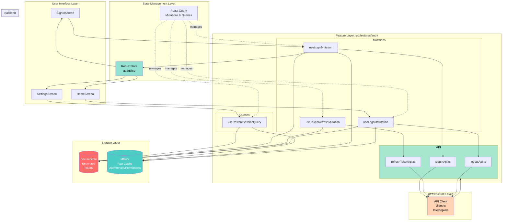
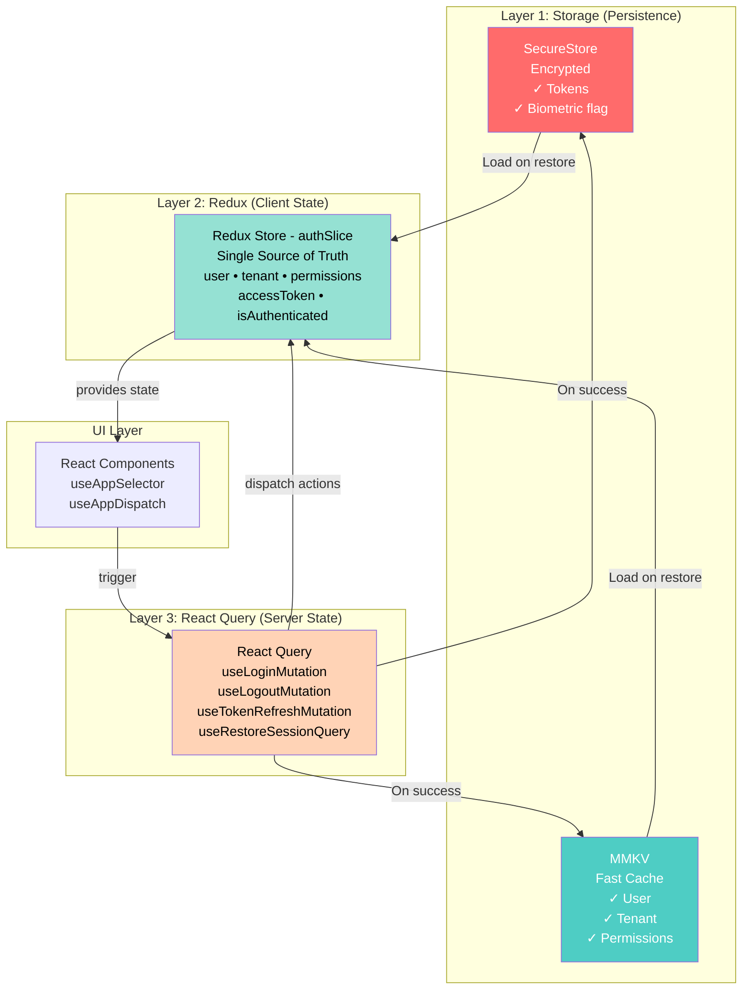
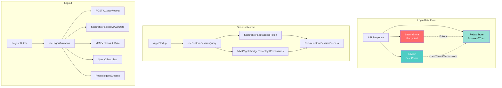
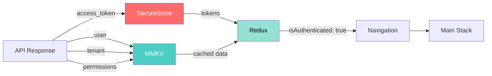
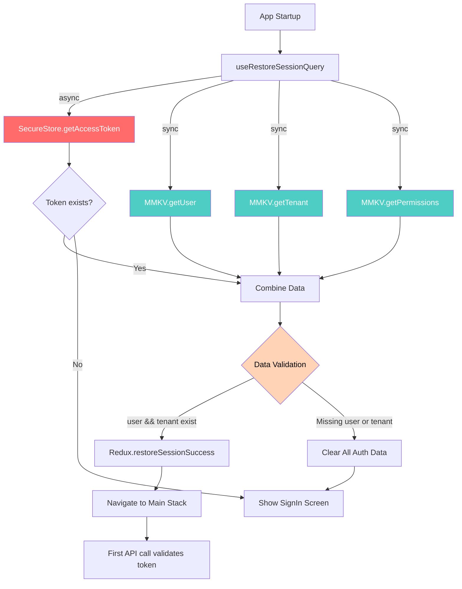
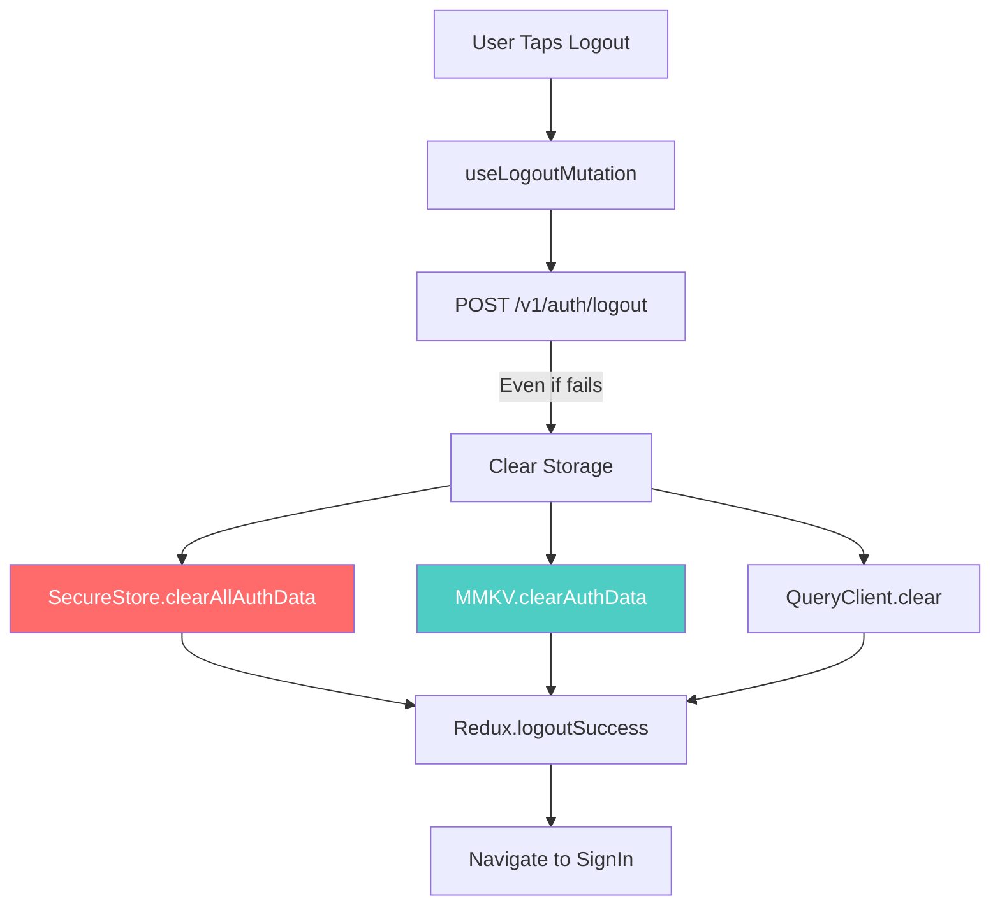
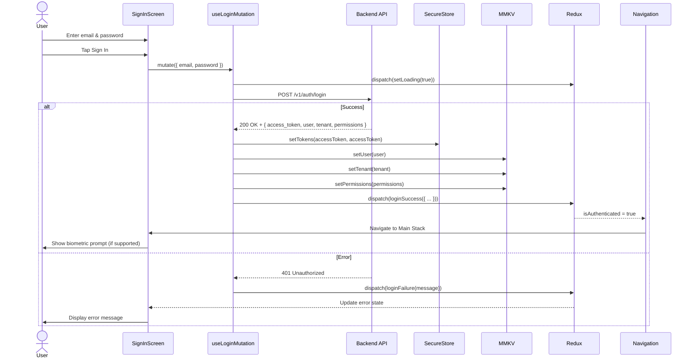
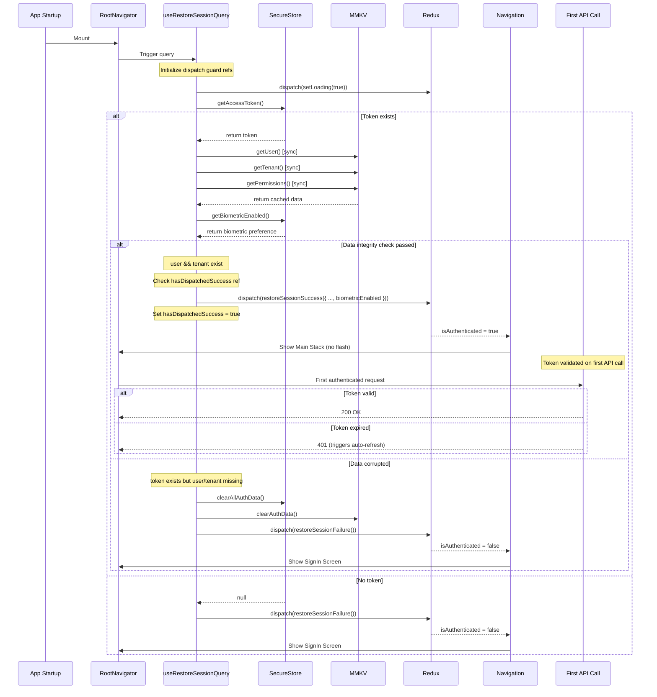
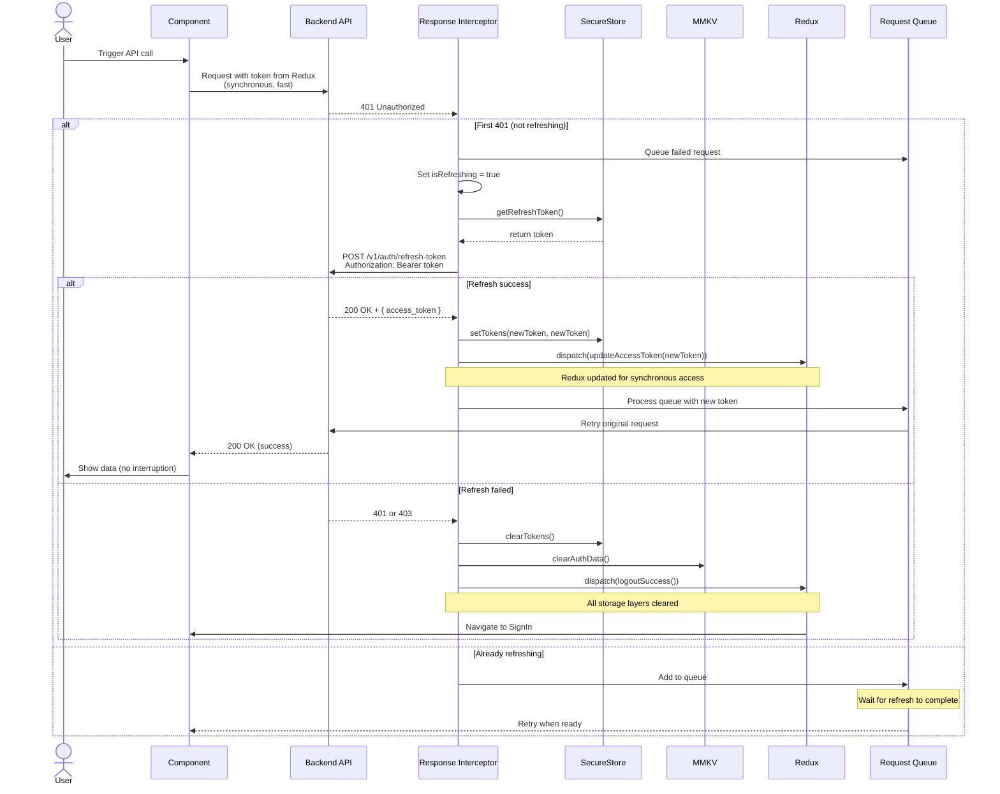
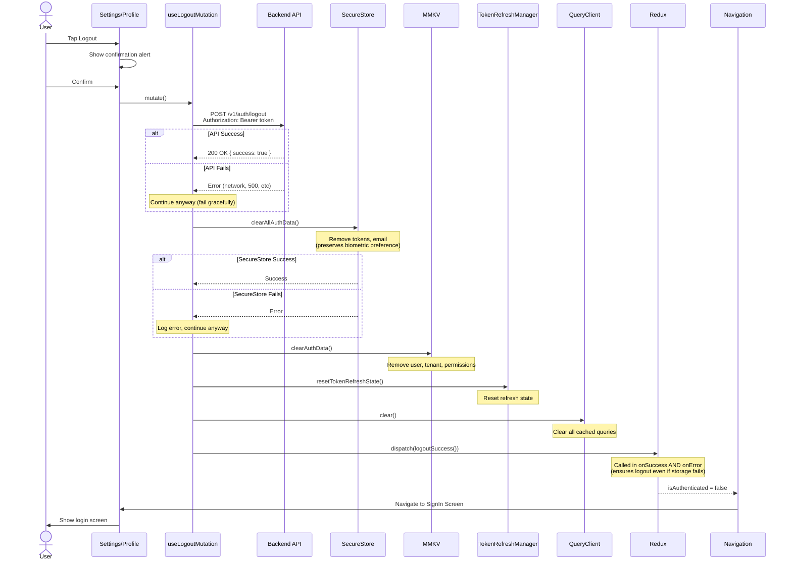

# Authentication System Documentation

Complete documentation for the authentication system in the UBS React Native application.

## Table of Contents

- [Overview](#overview)
- [Architecture](#architecture)
- [API Endpoints](#api-endpoints)
- [Storage Strategy](#storage-strategy)
- [Authentication Flows](#authentication-flows)
- [Token Management](#token-management)
- [Error Handling](#error-handling)
- [Security Considerations](#security-considerations)
- [Usage Examples](#usage-examples)

## Overview

The authentication system implements JWT-based authentication with:
- Email/password login
- Automatic token refresh
- Biometric authentication (Face ID, Touch ID, Android biometrics)
- Session persistence across app restarts
- Secure token storage
- Fast user data caching

**Key Technologies**:
- **Redux Toolkit**: Client state management
- **React Query (TanStack Query)**: Server state and mutations
- **Expo SecureStore**: Encrypted token storage
- **MMKV**: Fast, synchronous cache for non-sensitive data
- **Axios**: HTTP client with automatic token refresh

## Architecture

### System Architecture Overview

Complete authentication system architecture showing all layers and their interactions.



### Feature-Based Organization

Authentication logic is organized in `src/features/auth/`:

```
src/features/auth/
├── api/                    # API layer
│   ├── signInApi.ts       # POST /v1/auth/login
│   ├── refreshTokenApi.ts # POST /v1/auth/refresh-token
│   ├── logoutApi.ts       # POST /v1/auth/logout
│   └── index.ts
├── mutations/              # React Query mutations
│   ├── useLoginMutation.ts        # Login with rollback on MMKV failure
│   ├── useTokenRefreshMutation.ts # Manual refresh (API client handles automatic)
│   ├── useLogoutMutation.ts       # Logout with error handler for resilience
│   └── index.ts
├── queries/                # React Query queries
│   ├── useRestoreSessionQuery.ts  # Session restore with dispatch guards
│   └── index.ts
└── index.ts                # Feature barrel export
```

### State Management Layers

The authentication system uses a three-layer state management approach:



**Layer Responsibilities**:

1. **Storage Layer** (Persistence)
   - **SecureStore**: Encrypted storage for tokens (async)
   - **MMKV**: Fast cache for user data (synchronous)
   - Data survives app restarts

2. **Redux Layer** (Client State)
   - Single source of truth for app state
   - Drives navigation (Auth Stack vs Main Stack)
   - Synchronous access from any component
   - State: `{ user, tenant, permissions, accessToken, isAuthenticated, isLoading, error }`

3. **React Query Layer** (Server State)
   - Manages API mutations and queries
   - Handles loading/error states
   - Automatic retries and caching
   - Updates storage and Redux on success

## API Endpoints

**Base URL**: `https://api.stgtenant.hub-travel.getpayin.com`

### POST /v1/auth/login

Authenticate user with email and password.

**Request**:
```json
{
  "email": "user@example.com",
  "password": "password123",
  "remember": true,
  "device_name": "iPhone 14 Pro - iOS 17.1"
}
```

**Response** (200 OK):
```json
{
  "data": {
    "access_token": "37|d7Wc5aylMjc0gxyOUXfwfmUxVsM7RgUp4FeychExae762399",
    "token_type": "Bearer",
    "expires_in": 21600,
    "user": {
      "id": 1,
      "name": "John Doe",
      "email": "user@example.com"
    },
    "tenant": {
      "id": "a4ba7a64-d5d8-4a01-b303-02d76d77d0a9",
      "name": "Acme Corp"
    },
    "permissions": [
      "View:Dashboard",
      "ViewAny:Location",
      "Create:Location"
    ]
  }
}
```

**Token Lifetime**: 6 hours (21600 seconds)

**Device Name**: Auto-generated from device info (e.g., "iPhone 14 Pro - iOS 17.1"). Used for session tracking.

### POST /v1/auth/refresh-token

Refresh an expired access token.

**Request**:
- **Headers**: `Authorization: Bearer <current_access_token>`
- **Body**: None

**Response** (200 OK):
```json
{
  "data": {
    "access_token": "39|jT2IS9KyTNSPlJqQqBvUEx1MFrXywMY3Rm0jlgUX7410db85",
    "token_type": "Bearer",
    "expires_in": 21600
  }
}
```

**Note**: Backend uses a single token pattern. The same token is used for both authentication and refresh. When refreshed, a new token is generated.

### POST /v1/auth/logout

Logout user and invalidate token on backend.

**Request**:
- **Headers**: `Authorization: Bearer <access_token>`
- **Body**: None

**Response** (200 OK):
```json
{
  "success": true,
  "status_code": 200,
  "message": "Logged Out"
}
```

**Note**: Even if logout API fails, the app will clear local storage to ensure user can always log out.

## Storage Strategy

### Dual Storage Architecture

The app uses two storage systems for optimal performance and security:

#### 1. Expo SecureStore (Encrypted)

**Location**: [src/services/storage/secureStore.ts](../src/services/storage/secureStore.ts)

**Stored Data**:
- `auth_access_token` - JWT access token (encrypted)
- `auth_refresh_token` - Same as access token (encrypted)
- `biometric_enabled` - User preference boolean (persists across logout/login cycles)
- `user_email` - User's email (for convenience)

**Key Functions**:
- `setTokens(accessToken, refreshToken)` - Store tokens (validates non-empty)
- `getAccessToken()` - Retrieve access token (returns null on error)
- `getRefreshToken()` - Retrieve refresh token (returns null on error)
- `clearTokens()` - Remove tokens
- `clearAllAuthData()` - Remove tokens and email (preserves biometric preference)
- `clearAllAuthDataIncludingPreferences()` - Remove ALL data including biometric preference

**Error Handling**:
- Read operations return null on error (silent fallback)
- Write operations throw for caller handling
- Delete operations log errors but don't throw (non-critical)
- All operations wrapped in try-catch with logging

**Characteristics**:
- ✅ Encrypted and secure
- ✅ Platform-native security (Keychain on iOS, KeyStore on Android)
- ✅ Robust error handling
- ❌ Asynchronous (requires `await`)
- ❌ Slower than MMKV

#### 2. MMKV Storage (Fast Cache)

**Location**: [src/services/storage/mmkvStore.ts](../src/services/storage/mmkvStore.ts)

**Stored Data**:
- `user` - User profile `{ id, name, email }`
- `tenant` - Tenant info `{ id, name }`
- `permissions` - Array of permission strings

**Key Functions**:
- `setUser(user)` - Store user (throws on error for rollback handling)
- `getUser()` - Retrieve user (synchronous, returns null on parse error)
- `setTenant(tenant)` - Store tenant (throws on error for rollback handling)
- `getTenant()` - Retrieve tenant (synchronous, returns null on parse error)
- `setPermissions(permissions)` - Store permissions (throws on error for rollback handling)
- `getPermissions()` - Retrieve permissions (synchronous, returns [] on parse error)
- `clearAuthData()` - Clear all auth data

**Error Handling**:
- Uses `safeJsonParse()` helper for read operations
- JSON parse errors are caught, logged, and corrupted data is auto-cleared
- Write operations throw to allow caller rollback handling
- Prevents app crashes from corrupted storage data

**Characteristics**:
- ✅ Synchronous (no `await` needed)
- ✅ Very fast (10x faster than AsyncStorage)
- ✅ Perfect for non-sensitive cached data
- ✅ Resilient to data corruption
- ❌ Not encrypted
- ❌ Only for non-sensitive data

### Why Dual Storage?

| Requirement | Storage | Reason |
|------------|---------|--------|
| **Security** | SecureStore | Tokens are sensitive and require encryption |
| **Speed** | MMKV | Non-sensitive data accessed synchronously for better UX |
| **Persistence** | Both | Data survives app restarts |
| **Source of Truth** | Redux | Single source for app state, populated from both storages |

### Performance Optimization

**Token Access Strategy**:
- **Write operations** (login, refresh): Update all three layers (SecureStore → MMKV → Redux)
- **Read operations** (API requests): Read from Redux only (synchronous, in-memory)
- **Session restore**: Read from SecureStore + MMKV → populate Redux

**Benefits**:
- API requests are **~100-200ms faster** (no async SecureStore reads)
- Session restore includes **data integrity validation**
- All storage layers stay **perfectly synchronized**
- Security maintained (SecureStore still used for persistence)

### Data Flow

#### Storage Architecture Diagram



#### Login Flow Diagram



#### Session Restore Flow Diagram



#### Logout Flow Diagram



## Authentication Flows

### 1. Login Flow

Complete sequence diagram showing the login process from user input to navigation.



### 2. Session Restore Flow (App Startup)

Shows how the app restores user session on startup using cached data with data integrity validation and dispatch guards.



**Dispatch Guards**: The query uses `useRef` to track `hasDispatchedSuccess` and `hasDispatchedFailure`, preventing duplicate Redux dispatches when data reference changes but content is the same. Refs are reset when query starts loading.

### 3. Token Refresh Flow (Automatic)

Demonstrates automatic token refresh when API returns 401 error. This flow ensures complete state synchronization across all storage layers (SecureStore, MMKV, Redux).



### 4. Logout Flow

Shows the logout process including API call and storage cleanup with error resilience.



**Resilience**: The mutation has both `onSuccess` and `onError` handlers that call `finalizeLogout()`, ensuring Redux state is always cleared even if storage operations fail.

## Token Management

### Single Token Pattern

The backend uses a **single token pattern**:
- Only `access_token` is returned (no separate refresh token)
- The same token is used for:
  - Authentication (accessing protected endpoints)
  - Refresh (generating a new token when expired)
- When token expires, call `/v1/auth/refresh-token` with the current token
- Backend validates the token and returns a new one

### Token Lifecycle

```
Token Created (Login)
  ↓
Token Active (6 hours)
  ↓
Token Expires
  ↓
First API Call Returns 401
  ↓
Interceptor Refreshes Token
  ↓
New Token Active (6 hours)
  ↓
... repeat ...
```

**Token Expiration**: 6 hours (21600 seconds)

### Automatic Token Refresh

The API client ([src/services/api/client.ts](../src/services/api/client.ts)) includes optimized request and response interceptors:

**Request Interceptor** (Performance Optimization):
- Reads token from **Redux** (synchronous, in-memory) instead of SecureStore (async, encrypted)
- Provides **~100-200ms performance improvement per API call**
- Maintains security by syncing Redux with SecureStore on every auth operation

**Response Interceptor** (Token Refresh):
1. **Detects 401 errors** from API responses
2. **Skips refresh for refresh endpoint** to prevent infinite loops
3. **Prevents duplicate refreshes** using `TokenRefreshManager` class (encapsulates state)
4. **Queues failed requests** during refresh to prevent race conditions
5. **Uses separate axios instance** for refresh call (bypasses request interceptor to avoid attaching expired token)
6. **Retrieves refresh token from SecureStore** (not Redux, to get the actual stored token)
7. **On success**:
   - Updates SecureStore with new token (persistence)
   - Updates Redux with new token via `updateAccessToken()` (synchronous access)
   - Retries all queued requests with new token
8. **On failure**:
   - Clears SecureStore (tokens only, preserves biometric preference)
   - Clears MMKV (user, tenant, permissions)
   - Dispatches `logoutSuccess()` to Redux
   - Triggers automatic navigation to SignIn screen

**State Synchronization**: All three storage layers (SecureStore, MMKV, Redux) are kept in perfect sync to prevent state desynchronization issues.

**Testing Support**: Export `resetTokenRefreshState()` to reset the refresh manager state between tests or after logout.

### Request Queuing

During token refresh, multiple simultaneous API calls might fail with 401. To prevent multiple refresh attempts:

1. First 401 triggers refresh
2. Subsequent 401s during refresh are **queued**
3. After refresh succeeds, all queued requests **retry** with new token
4. If refresh fails, all queued requests **reject**

This prevents:
- Multiple simultaneous refresh calls
- Race conditions
- Duplicate requests

## Error Handling

### Layered Error Handling

The app uses a **layered approach** to error handling:

#### 1. API Client Layer

**Location**: [src/services/api/client.ts](../src/services/api/client.ts)

**Responsibilities**:
- Catch 401 errors → trigger token refresh
- Handle refresh failures → logout user
- Queue requests during refresh

**Error Format**: Axios errors with `error.response?.data?.message`

#### 2. React Query Layer

**Location**: [src/features/auth/mutations/](../src/features/auth/mutations/)

**Responsibilities**:
- Extract error messages from API responses
- Provide user-friendly fallback messages
- Update Redux with error state

**Example**:
```typescript
onError: (error: any) => {
  const message =
    error.response?.data?.message ||
    error.response?.data?.error ||
    'Login failed. Please try again.';
  dispatch(loginFailure(message));
}
```

#### 3. Redux Layer

**Location**: [src/store/auth/authSlice.ts](../src/store/auth/authSlice.ts)

**Responsibilities**:
- Store error message as `string | null`
- Provide error to components via `useAppSelector`

**Actions**:
- `loginFailure(message)` - Set error, clear loading
- `clearError()` - Clear error message

#### 4. Component Layer

**Responsibilities**:
- Display error messages to user
- Provide retry mechanisms
- Handle UI state (disable buttons, show spinners)

### Common Error Scenarios

| Scenario | HTTP Status | Handling |
|----------|-------------|----------|
| **Invalid credentials** | 401 | Show error message, keep user on SignIn |
| **Network error** | - | Show generic error, allow retry |
| **Token expired** | 401 | Auto-refresh via interceptor, transparent to user |
| **Refresh fails** | 401/403 | Force logout, redirect to SignIn |
| **Logout fails** | Any | Continue with local cleanup, always logout locally |
| **Session restore fails** | - | Clear storage, show SignIn |

## Security Considerations

### Token Storage

✅ **DO**:
- Store tokens in SecureStore (encrypted)
- Use platform-native security (Keychain, KeyStore)
- Clear tokens on logout

❌ **DON'T**:
- Store tokens in AsyncStorage (not encrypted)
- Store tokens in Redux only (lost on app close)
- Log tokens to console in production

### MMKV Storage

✅ **DO**:
- Store non-sensitive data only (user profile, tenant, permissions)
- Clear MMKV on logout
- Validate data from MMKV before use

❌ **DON'T**:
- Store tokens in MMKV (not encrypted)
- Store passwords or PII in MMKV
- Trust MMKV data without validation

### API Communication

✅ **DO**:
- Use HTTPS in production (`https://api.stgtenant.hub-travel.getpayin.com`)
- Send tokens in `Authorization: Bearer` header
- Validate token expiration on backend

❌ **DON'T**:
- Use HTTP in production
- Send tokens in URL query parameters
- Trust client-side token validation only

### Biometric Authentication

✅ **DO**:
- Check device support before enabling
- **Require successful biometric auth before enabling** (proves user can use biometrics)
- Store biometric preference in SecureStore (persists across sessions)
- Fall back to email/password if biometric fails
- Read `hasStoredToken` from Redux (updates immediately on logout)
- Use `isMountedRef` to prevent memory leaks on unmount

❌ **DON'T**:
- Force biometric authentication
- Store biometric data (handled by OS)
- Skip token validation after biometric success
- Clear `biometricEnabled` on logout (it's a user preference)
- Read `hasStoredToken` from SecureStore (becomes stale after logout)

## Usage Examples

### Using Login Mutation

```typescript
import { useLoginMutation } from '../features/auth';

function SignInScreen() {
  const loginMutation = useLoginMutation();
  const { error, isLoading } = useAppSelector(state => state.auth);

  const handleLogin = async () => {
    loginMutation.mutate(
      { email, password },
      {
        onSuccess: () => {
          // Navigation handled automatically by Redux state change
          console.log('Login successful');
        },
        onError: (err) => {
          // Error already dispatched to Redux, just log
          console.error('Login failed:', err);
        },
      }
    );
  };

  return (
    <View>
      <TextInput value={email} onChangeText={setEmail} />
      <TextInput value={password} onChangeText={setPassword} secureTextEntry />

      {error && <Text style={styles.error}>{error}</Text>}

      <Button
        onPress={handleLogin}
        disabled={isLoading}
        title={isLoading ? 'Signing in...' : 'Sign In'}
      />
    </View>
  );
}
```

### Using Logout Mutation

```typescript
import { useLogoutMutation } from '../features/auth';

function SettingsScreen() {
  const logoutMutation = useLogoutMutation();

  const handleLogout = () => {
    Alert.alert(
      'Logout',
      'Are you sure you want to logout?',
      [
        { text: 'Cancel', style: 'cancel' },
        {
          text: 'Logout',
          onPress: () => logoutMutation.mutate(),
          style: 'destructive',
        },
      ]
    );
  };

  return (
    <View>
      <Button
        onPress={handleLogout}
        title="Logout"
        disabled={logoutMutation.isLoading}
      />
    </View>
  );
}
```

### Accessing Auth State

```typescript
import { useAppSelector } from '../store/hooks';

function ProfileScreen() {
  const { user, tenant, permissions, isAuthenticated } = useAppSelector(
    state => state.auth
  );

  if (!isAuthenticated || !user) {
    return <Text>Not authenticated</Text>;
  }

  const hasPermission = (permission: string) =>
    permissions.includes(permission);

  return (
    <View>
      <Text>Welcome, {user.name}</Text>
      <Text>Email: {user.email}</Text>
      <Text>Tenant: {tenant?.name}</Text>

      {hasPermission('Create:Hotels') && (
        <Button title="Create Hotel" onPress={handleCreate} />
      )}
    </View>
  );
}
```

### Session Restore

```typescript
// In RootNavigator.tsx
import { useRestoreSessionQuery } from '../features/auth';

function RootNavigator() {
  const { isLoading } = useRestoreSessionQuery();
  const { isAuthenticated } = useAppSelector(state => state.auth);

  if (isLoading) {
    return <SplashScreen />;
  }

  return (
    <NavigationContainer>
      <Stack.Navigator>
        {isAuthenticated ? (
          <Stack.Screen name="Main" component={MainStack} />
        ) : (
          <Stack.Screen name="Auth" component={AuthStack} />
        )}
      </Stack.Navigator>
    </NavigationContainer>
  );
}
```

---

**For more information**:
- See [CLAUDE.md](../CLAUDE.md) for project overview
- See [MIGRATION_MOCK_TO_REAL_API.md](./MIGRATION_MOCK_TO_REAL_API.md) for migration guide
- Source code: [src/features/auth/](../src/features/auth/)
